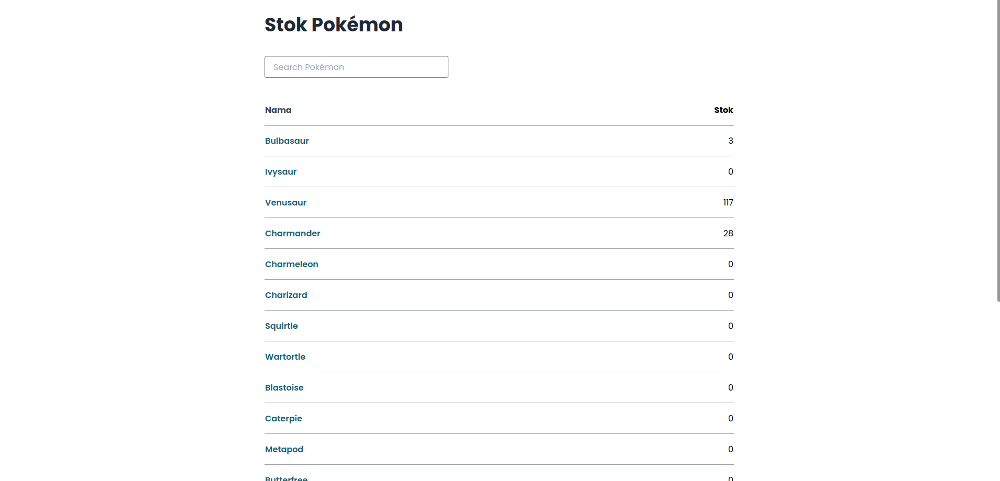
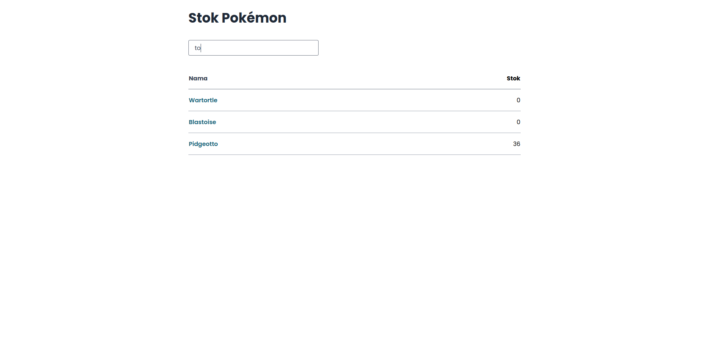
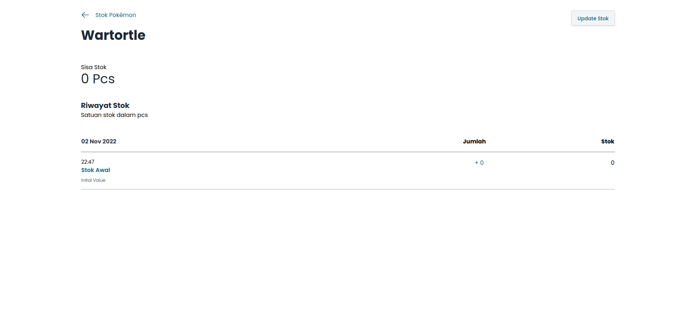
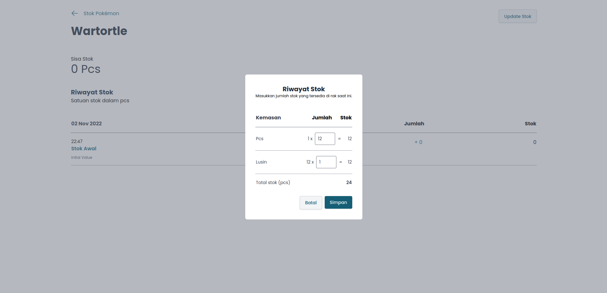
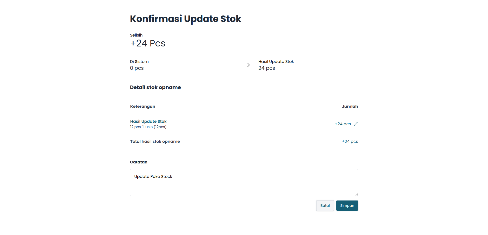
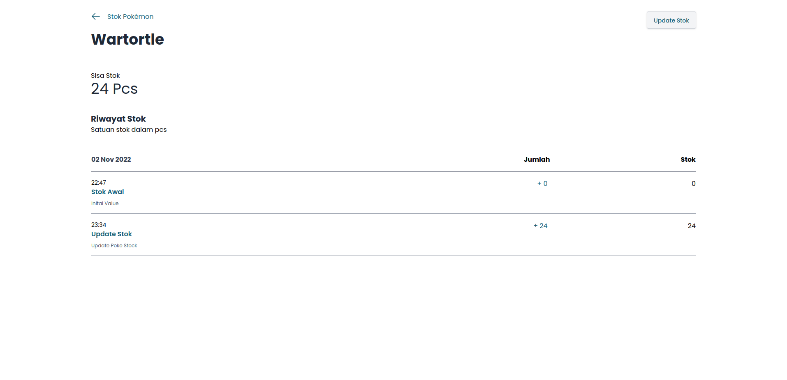

# PWA Pokémon Stock App

I'm developer of 'team rocket'. As a good team member, I assist the team rocket in properly counting pokemon. so, I create an App with ReactJS :

- My team can install the app on their device (laptop and phone)

- My team can search pokemon by keyword

- My team can add new stock of the pokemon

- and the change of data will be record

## Source
[PokeAPI](https://pokeapi.co/)

## Demo
[Demo](https://glittery-dolphin-370425.netlify.app/)

## TechStack


## Overview














## Getting Started

First, Clone the project :

```bash
git clone https://github.com/siunixdev/pwa-pokemon-stock-app
```

go to project directory and install all dependencies with

```bash
npm install
```

and run the development server:

```bash
npm run dev
# or
yarn dev
```